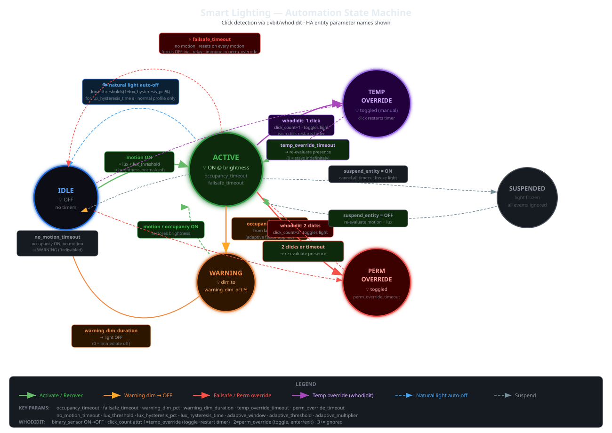

# Smart Lighting

[](https://github.com/hacs/integration)

Area-based smart lighting automation for Home Assistant. Zero external dependencies.

## Features

- **Area-based configuration** — HA area selector with entity filtering
- **Motion + occupancy** — motion triggers ON (OR logic for multiple sensors), occupancy prevents timeout
- **Lux-aware** — activates only below configurable threshold
- **Dual brightness profiles** — normal and soft (time-based or entity-based switching)
- **Multiple bulbs** — configure multiple smart bulbs per relay, both for normal and soft profile
- **Alternate soft actuators** — optional separate bulbs/relay for soft profile
- **Pre-off warning dim** — dims to configurable % before turning off
- **Embedded click detection** — monitors a switch entity, detects Physical vs Automation/UI interactions via HA context analysis
- **Manual override** — single click (temporary) and double click (permanent), Physical only
- **Dedicated override timers** — temp override timeout (0=never) and perm override timeout
- **Failsafe** — no motion for long time forces OFF (resets on motion, immune to perm override)
- **No-motion fallback** — occupancy ON but no motion for configurable time → warning dim → OFF
- **Natural light auto-off** — lux rises significantly while lights on → turns off (windows opened)
- **Adaptive timeout** — extends occupancy timeout in high-traffic areas, decays back to normal
- **Suspend mode** — external entity pauses all automation (e.g. movie mode)
- **Set lux threshold from sensor** — button captures current reading as new threshold
- **Runtime-adjustable** — all parameters adjustable without reconfiguration, values persist across restarts
- **Virtual device** — all entities grouped under one HA device per area
- **Custom Lovelace card** — auto-registered, with timer bar, mode indicator, status icons, settings popup
- **Localized** — EN, IT, FR, ES, DE

## Installation

### HACS (recommended)

1. HACS → Integrations → ⋮ → Custom repositories
2. Add `https://github.com/dvbit/smart-lighting` as **Integration**
3. Search "Smart Lighting" and install
4. Restart Home Assistant

The custom Lovelace card is auto-registered as a frontend resource.

### Manual

Copy `custom_components/smart_lighting/` to `config/custom_components/` and restart. Copy `www/smart-lighting-card.js` to `/config/www/` and add as resource manually.

## Configuration

Add via **Settings → Devices & Services → Add Integration → Smart Lighting**.

### Step 1: Area

Select the HA area. All entity selectors in subsequent steps are filtered by this area.

### Step 2: Sensors

- **Motion sensors** — one or more binary_sensors (OR logic: any triggers activation)
- **Occupancy sensor** — one binary_sensor (prevents timeout while occupied)
- **Lux sensor** — one sensor (activation only below threshold)
- **Lux threshold** — ambient light cutoff in lux

### Step 3: Actuators

- **Smart bulbs** — optional, multiple light entities
- **Relay switch** — optional switch entity
- At least one actuator required
- **Soft profile bulbs** — optional, multiple light entities used during soft profile
- **Soft profile relay** — optional switch used during soft profile
- **Monitored switch** — optional entity to monitor for physical click detection
- **Click time window** — seconds to accumulate clicks (default 1.5s)
- **Suspend entity** — optional binary_sensor/input_boolean to pause automation

### Step 4: Timings

- **Occupancy timeout** — seconds before warning dim after occupancy clears (default 300s)
- **Failsafe timeout** — seconds without motion before forced OFF (default 3600s)
- **Perm override timeout** — auto-expiry for permanent override (default 3600s)
- **Temp override timeout** — auto-expiry for temporary override, 0=never (default 0)
- **Warning dim %** — brightness percentage during warning (default 30%)
- **Warning dim duration** — seconds to stay dimmed before OFF (default 10s)
- **No-motion timeout** — seconds with occupancy but no motion before OFF (default 1800s)
- **Adaptive window** — rolling window for counting activations (default 600s)
- **Adaptive threshold** — activations in window before extending timeout (default 3)
- **Adaptive multiplier** — factor per extra activation over threshold (default 1.5)
- **Adaptive max factor** — maximum multiplier cap (default 4.0)
- **Lux hysteresis %** — percentage above threshold for natural light auto-off (default 10%)
- **Lux hysteresis time** — seconds lux must stay high before auto-off (default 5s)

### Step 5: Brightness Profiles

- **Normal brightness** — 1-255
- **Soft brightness** — 1-255
- **Profile mode** — time range or entity-based
- **Soft time start/end** — time range for soft profile
- **Soft profile entity** — binary_sensor/input_boolean trigger

All settings editable via **Options** without removing the integration.

## Entities

Each configured area creates a virtual device with these entities:

### Light

| Entity | Description |
|--------|-------------|
| `light.smart_lighting_{area}` | Main controller, tap = toggle (simulates single press) |

### Sensors (diagnostic)

| Entity | Description |
|--------|-------------|
| `sensor.*_state` | State machine: idle, active, warning, temp_override, perm_override, suspended |
| `sensor.*_profile` | Active profile: normal or soft |
| `sensor.*_occupancy_timer` | Occupancy timeout remaining (s) |
| `sensor.*_failsafe_timer` | Failsafe timeout remaining (s) |
| `sensor.*_override_timer` | Active override timeout remaining (s) |
| `sensor.*_warning_timer` | Warning dim remaining (s) |
| `sensor.*_adaptive_factor` | Current adaptive multiplier |
| `sensor.*_activation_count` | Activations in adaptive window |
| `sensor.*_lux` | Current ambient light (lx), real-time |
| `sensor.*_click_count` | Current click count in window |
| `sensor.*_interaction_type` | Last interaction: Physical/Automation/UI |
| `sensor.*_acting_user` | Last acting user or "Physical" |
| `sensor.*_click_time_window` | Configured click window (s) |

### Numbers (config, runtime-adjustable, persistent)

| Entity | Description |
|--------|-------------|
| `number.*_occupancy_timeout` | Occupancy timeout (s) |
| `number.*_failsafe_timeout` | Failsafe timeout (s) |
| `number.*_perm_override_timeout` | Perm override timeout (s) |
| `number.*_temp_override_timeout` | Temp override timeout (s), 0=never |
| `number.*_warning_dim_pct` | Warning dim brightness (%) |
| `number.*_warning_dim_duration` | Warning dim duration (s) |
| `number.*_no_motion_timeout` | No-motion fallback timeout (s) |
| `number.*_lux_threshold` | Lux threshold (lx) |
| `number.*_adaptive_window` | Adaptive window (s) |
| `number.*_adaptive_threshold` | Adaptive threshold (count) |
| `number.*_adaptive_multiplier` | Adaptive multiplier |
| `number.*_adaptive_max_factor` | Adaptive max factor |
| `number.*_lux_hysteresis_pct` | Lux hysteresis (%) |
| `number.*_lux_hysteresis_time` | Lux hysteresis time (s) |

### Button

| Entity | Description |
|--------|-------------|
| `button.*_set_lux_threshold` | Capture current lux reading as new threshold |


## State Machine



## Core Logic

### Activation

Motion detected + lux below threshold → light ON at current profile brightness.

### Deactivation

Occupancy clears → occupancy timeout starts → warning dim (brightness reduced to X%) → after dim duration → OFF.

### Actuation Rules

- **Multiple bulbs + relay**: all bulbs ON with same brightness, relay ON. OFF: all bulbs OFF, relay stays ON.
- **Only bulbs**: standard on/off for all bulbs.
- **Only relay**: standard on/off.
- **Soft profile**: if soft actuators configured, uses those instead during soft profile.
- **Failsafe OFF**: forces everything off including relay.

## Manual Override

### Click Detection (embedded)

Monitors a configured switch/light entity. Analyzes HA event `context.user_id`:
- `None` → Physical (wall switch press)
- `user_id` with `parent_id` → Automation → ignored for override
- `user_id` without `parent_id` → UI → ignored for override

Clicks accumulate within the click time window. After window expires:
- **1 click** → temporary override
- **2 clicks** → permanent override
- **3+ clicks** → ignored (accidental)

### Temporary Override (1 click)

- Toggles light, freezes state
- Exit: another single click OR temp_override_timeout (0 = stays indefinitely)
- On exit: re-evaluates motion + lux conditions
- Use cases: "stay in the dark", "simulate presence"

### Permanent Override (2 clicks)

- Toggles light, freezes state
- Exit: another double click OR perm_override_timeout
- Immune to failsafe
- On exit: re-evaluates motion + lux conditions

## Failsafe

Resets on every motion detection (even during override). If no motion for `failsafe_timeout` seconds:
- Forces OFF everything including relay
- Exception: permanent override is immune

## No-Motion Fallback

If occupancy sensor stays ON but no motion for `no_motion_timeout` seconds → warning dim → OFF. Protects against stuck occupancy sensors or static heat sources (e.g. a warm laptop on a desk).

## Natural Light Auto-Off

If lights are ON in normal profile (not soft, not override) and ambient light exceeds `lux_threshold × (1 + lux_hysteresis_pct/100)` for `lux_hysteresis_time` consecutive seconds → turns off. Handles windows being opened.

## Adaptive Timeout

In high-traffic areas, frequent on/off cycling is prevented:
- Activations counted in a rolling window
- When count exceeds threshold: occupancy timeout multiplied progressively
- Factor decays when timeout expires normally (traffic calmed)
- Monitored via `sensor.*_adaptive_factor` and `sensor.*_activation_count`

## Suspend Mode

Optional `suspend_entity` (binary_sensor/input_boolean):
- **ON**: state = "suspended", all timers cancelled, light stays as-is, all events ignored
- **OFF**: re-evaluates motion + lux, activates or deactivates accordingly
- Use case: external scene automation (movie mode) takes over lighting

## Custom Card

```yaml
type: custom:smart-lighting-card
area: cucina
name: Cucina                    # optional display name
icon_main: mdi:ceiling-light    # optional, normal profile icon
icon_soft: mdi:lamp             # optional, soft profile icon
```

- **Top**: timer progress bar with type icon (hidden if idle)
- **Center**: large light icon (switches by profile), tap = toggle
- **Below icon**: area name
- **Mode indicator**: Idle / Automatic / Warning / Manual / Override / Suspended
- **Bottom-left**: motion, occupancy, lux icons — click opens more-info of source entity
- **Bottom-right**: settings gear → popup with all parameters + set lux threshold button

## License

MIT
